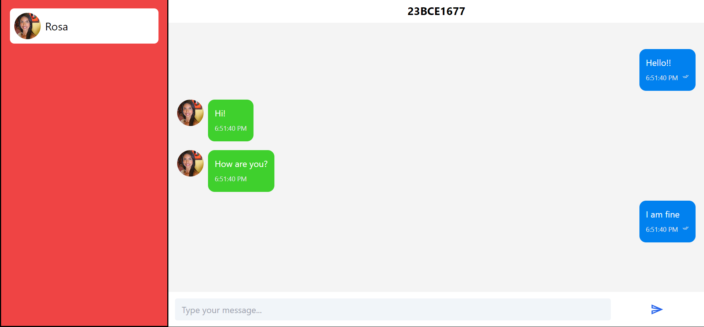

# Chat App

A real-time chat application built with React, TailwindCSS, and GraphQL. This app allows users to engage in real-time conversations with a modern, responsive UI.

## Features

- **Real-time Messaging:** Send and receive messages instantly.
- **User Authentication:** Secure login and registration.
- **Responsive Design:** Optimized for both desktop and mobile screens.
- **Modern UI:** Clean and user-friendly interface styled with TailwindCSS.

## Technologies Used

- **Frontend:** React, Vite, TailwindCSS
- **Backend:** GraphQL-Yoga
- **Styling:** TailwindCSS

## Screenshots

# React + Vite

This template provides a minimal setup to get React working in Vite with HMR and some ESLint rules.

Currently, two official plugins are available:

- [@vitejs/plugin-react](https://github.com/vitejs/vite-plugin-react/blob/main/packages/plugin-react/README.md) uses [Babel](https://babeljs.io/) for Fast Refresh
- [@vitejs/plugin-react-swc](https://github.com/vitejs/vite-plugin-react-swc) uses [SWC](https://swc.rs/) for Fast Refresh
